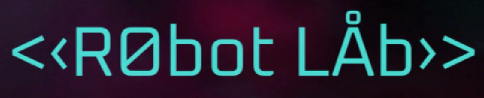

    

---

Robot Lab is a single player 2D platformer/ coding game.

---

    

    

---

# Play it online!

You can play the game online here: https://you3o3.github.io/Robot-Lab/.

# Report

This is a project of the course COMP3329 in HKU. You can see the report of the project [here](GitResources/report.pdf).

# Missing folders

Some folders are not uploaded because they have Unity Asset Store EULA license or other licenses. Most of them are free to download. The following shows a complete list:

|                   **Folder name**                  |                                              **URL**                                             |
|:--------------------------------------------------:|:------------------------------------------------------------------------------------------------:|
|         `/Assets/Sprite/CGY_SciFi_Interface/`        |         https://assetstore.unity.com/packages/2d/gui/icons/sci-fi-interface-frames-10747         |
|                `/Assets/Sprite/DinV/`                | https://assetstore.unity.com/packages/2d/textures-materials/dynamic-space-background-lite-104606 |
|      `/Assets/Sprite/#NVJOB Alpha Flashing UI/`      |        https://assetstore.unity.com/packages/tools/gui/alpha-flashing-ui-ui-shaders-164360       |
|           `/Assets/Sprite/Free Pixel Army/`          |    https://assetstore.unity.com/packages/2d/characters/free-pixel-army-platformer-pack-168264    |
|              `/Assets/Sprite/Sci-Fi UI/`             |                https://assetstore.unity.com/packages/2d/gui/sci-fi-gui-skin-15606                |
| `/Assets/Sprite/Sprites - Lasers Bullets #1 [66]v2/` |                                 https://wenrexa.itch.io/laser2020                                |
|              `/Assets/Sound/Sci-Fi-Sfx/`             |               https://assetstore.unity.com/packages/audio/sound-fx/sci-fi-sfx-32830              |
|             `/Assets/Sound/Dynamic Music`            |               https://assetstore.unity.com/packages/audio/music/dynamic-music-35925              |
|                `/Assets/Sound/UI Sfx/`               |                 https://assetstore.unity.com/packages/audio/sound-fx/ui-sfx-36989                |
